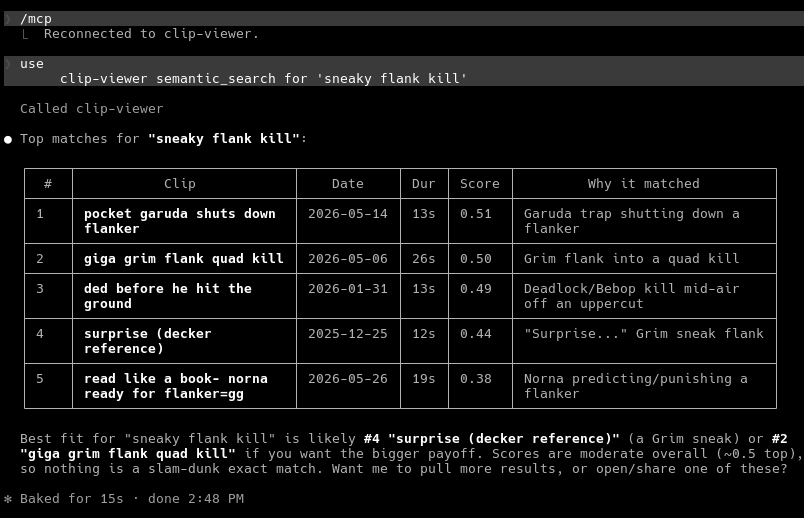

# clip-db

Tag, categorize, and query gaming clips. Controlled-vocabulary tagging where an LLM
maps a short free-text description onto a fixed tag list (`tags.json`) — the tagging is
exact and constrained, no frame/audio AI. Batch tagging is a script; querying is a local
MCP offering both exact tag search and semantic, meaning-based search.

> **Retrieval-augmented generation (RAG) over the clip corpus.** Each clip's
> description + tags are embedded with a local, frozen sentence-transformers model into a
> [`sqlite-vec`](https://github.com/asg017/sqlite-vec) index living beside the SQLite clip
> index; a natural-language question runs **cosine top-k retrieval**, then Claude
> **synthesizes a grounded answer that cites the clips it used** — retrieval and generation
> both exposed as MCP tools. See **[Semantic search & Q&A (RAG)](#semantic-search--qa-rag)**.

Two projects over one shared core:

```
clip_core/            # shared: config, tags vocab, sqlite index, media I/O, llm_classify,
                      #   query (exact) + embed/rag (semantic search + grounded answers)
clip-tagger/          # ingest.py — batch: intake move + tag/categorize (auto-embeds new clips)
clip-viewer-mcp/      # server.py — stdio MCP: exact query, semantic_search, RAG ask
clip-distributor/     # compress.py + share.py — size-fit a clip under the Discord cap, to clipboard
```

## Clip flow

1. Record on Windows or Linux. A separate (user-owned) step drops clips into the
   shared staging dir `os-shared/transfer/clips/` (`/mnt/os-shared/transfer/clips` on Linux).
2. `clip-tagger/ingest.py` moves each **master** out of staging into the ext4 library,
   probes metadata, classifies the description provided the user as user-in-the-loop against the vocab, 
   writes an index row, and generates its mixed-audio `*_merged.mp4` 
   in the library (short masters only, gated by
   `CLIP_AUTO_MERGE_MAX_SECONDS`; `--no-merge` opts out). Masters are `*.mp4` excluding
   `*_merged.mp4`; merged files are regenerable build output (`merge.py` rebuilds them).
3. `clip-viewer-mcp/server.py` exposes query + retrieval tools to an MCP client (Claude Code).

## Tags

The vocabulary in `tags.json` has two tiers: **generic** tags (cross-game: `clutch`,
`fail`, …) and **game** tags, where the game's display name is a tag and each
weapon/module/ability is a tag, organised into readability groups whose labels are
*not* tags. The classifier is constrained to this list. See **[docs/tags.md](docs/tags.md)**
for the model, how the reader flattens/renders it, and how to add a new game.
War Robots Frontiers tags are regenerated from source via
`scripts/extract_wrf_tags.py`.

## Semantic search & Q&A (RAG)

Exact tag search (`query`) is precise when you know the tag. Semantic search finds clips by
**meaning** — *"that insane comeback on ascent"* reaches a clip tagged `clutch` it never
shared a word with. Two MCP tools, both over the same vector index:

- **`semantic_search(query, k)`** — retrieval. Embeds the query and returns the cosine
  top-k clips by meaning, best first.
- **`ask(question, k)`** — retrieval **+ generation** (the full RAG loop). Retrieves the
  top-k, feeds them to Claude as grounded context, and returns a synthesized answer that
  **cites the clip ids it used** — answering from the retrieved clips only, and saying so
  when none fit. Citations are schema-pinned to the retrieved stems, so a cited clip is
  always real.



How it works: each clip's `description + tags` is embedded with a local, frozen
`sentence-transformers` model (`CLIP_EMBED_MODEL`, default `all-MiniLM-L6-v2`) — no API key,
no per-call cost — into a `sqlite-vec` `vec0` table beside the clip index. Tags are embedded
alongside the description so game jargon carries signal the free-text may lack. The model is
**pinned** (recorded in the index): changing it invalidates every stored vector, so re-embed
with `--all`. Generation reuses the same `claude` CLI path as tagging (subscription-billed).

```bash
.venv/bin/python scripts/embed_backfill.py            # embed clips missing a vector (incremental)
.venv/bin/python scripts/embed_backfill.py --all      # re-embed everything (after a model change)
```

New clips are embedded automatically on ingest; the backfill is for the initial corpus or a
model change. Retrieval quality is validated by hand on real queries; extending `evals/` with
a recall@k retrieval metric is the natural next step.

## Evaluation

The classifier is regression-tested against a hand-labeled golden set with a real
precision/recall harness — because the output is structured and constrained to the
vocabulary, quality is a measured number, not a vibe. Latest baseline
(`evals/baseline.json`, `claude-sonnet-4-5`, 15 cases × 5 runs each):

| Metric | Score |
|--|--|
| **Micro-F1** (tag-level) | **0.996** |
| Macro-F1 | 0.998 |
| Exact-match rate (whole clip correct) | 0.973 |
| Precision (all tags) | 1.000 — no wrong or invented tags |
| Proposed-tag false-positive rate | 0.000 |

What the harness (`evals/run_eval.py`) actually does:

- **Golden set** (`evals/golden.jsonl`) mixes literal cases, meaning-not-string cases
  (`"whiffed everything"` → `fail`, not a substring match), and alias/implication
  expansion (`"cage trap"` → `snake catcher` → its module `garuda`).
- **Regression gate** — `--gate` exits non-zero if micro-F1 falls below the stored
  baseline, so a prompt or model change can't silently degrade tagging.
- **Nondeterminism is measured, not ignored** — each case runs N times; the harness
  reports per-run F1 variance (mean 0.996, stdev 0.005) and a per-case stability rate.
- **Token-free reruns** — every model call is cached per run, so re-scoring iterates
  for free and only a deliberate re-collect spends model budget.

```bash
.venv/bin/python evals/run_eval.py --runs 5            # score against the golden set
.venv/bin/python evals/run_eval.py --runs 5 --gate     # regression gate vs baseline.json
```

## Asset model

One logical asset per clip: a split-audio **master** (source of truth) plus an optional
regenerable `*_merged.mp4`, linked by filename stem (`clip123.mp4` ↔ `clip123_merged.mp4`
→ asset `clip123`). Tagged once, on the master. Tags live in a rebuildable SQLite index
(optionally embedded in the master via ExifTool).

## Setup

```bash
python3 -m venv .venv
.venv/bin/pip install -U pip
.venv/bin/pip install -r requirements-dev.txt   # runtime + pytest
cp .env.example .env                            # then edit paths
.venv/bin/pytest
```

Paths are configured entirely via `.env` (see `.env.example`). Semantic search pulls in
`sentence-transformers` (and CPU `torch`) via `requirements.txt`; the first embedding call
downloads the small model (`all-MiniLM-L6-v2`, ~90 MB) once, then runs fully local.
Classification runs through the **`claude` CLI** (Claude Code in print mode), so it bills
against your logged-in Claude subscription — no Anthropic API key. The CLI must be on `PATH`
and authenticated (run `claude` once to log in). `CLIP_MODEL` (default `claude-sonnet-4-5`)
accepts any id/alias `claude --model` takes.

## Usage

Tagging is three decoupled steps: **describe** (write a sentence per clip), **ingest**
(batch-classify + move + index), **review** (fix tags / grow the vocab). Describing is
separate from tagging so the whole batch is classified in one call (the vocabulary is sent
once, not per clip).

```bash
.venv/bin/python clip-tagger/describe.py                  # sentence per staged master -> descriptions.json
.venv/bin/python clip-tagger/ingest.py --dry-run          # preview: one batched classify, no moves
.venv/bin/python clip-tagger/ingest.py                    # classify all, move into library, index
.venv/bin/python clip-tagger/review.py                    # confirm/fix tags; add proposed tags to the vocab
.venv/bin/python scripts/embed_backfill.py                # embed clips for semantic search (one-time / after adds)
.venv/bin/python clip-viewer-mcp/server.py                # run the MCP over stdio (query, semantic_search, ask)
```

The per-clip descriptions live in a manifest (`descriptions.json` in the intake dir by
default; `CLIP_DESCRIPTIONS_PATH` to relocate) mapping asset stem -> sentence — hand-write it
for a backlog, or use `describe.py` interactively.

## Related: serverless cloud port

The same constrained classifier also runs as a serverless AWS service in
**[clip-classifier-aws](https://github.com/Surxe/clip-classifier-aws)** — `clip_core`'s
`classify.py` / `tags.py` / `tags.json` ported onto Amazon Bedrock (Claude) behind AWS
Lambda + API Gateway, packaged as a container image and provisioned with AWS SAM. Only the
model runner changes (the local `claude` CLI call becomes a Bedrock `InvokeModel` call);
the system prompt, JSON schema, and vocabulary are identical. It's a portfolio/learning
build — deployed on demand, torn down when idle.
